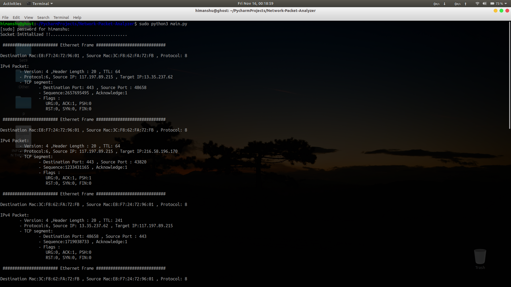

# Network-Packet-Analyzer 

## Short Description:-
This program allows us to analyze the ethernet/network packets (IPv4 Only) that are routed through our device.
On running this program it displays various important information about the packets origin and destination such as its
addresses and ports,apart from these we can also analyze different layers of the frame to further investigate on 
its segments (UDP ,TCP, ICMP) to display its version and protocol infos.

**NOTE**:- i have not considered the core data that the frame is carrying beacause most of the times it is encrypted 
          unless untill the protocol is http, as those data are not encrypted. HTTP data are packed inside the packet
          as plain text.
 

## Requirements:-
 
   **Python3 -** 
      You can download and install it from it's [official website](https://www.python.org/downloads/).
      It is available for all types of platforms (windows , Linux and mac). In Linux/Mac it comes pre-installed.    
      Here i have used some of python's built in modules (*socket and struct*) for capturing and analyzing packets. 
     so there is no need of installing any external package. 
   
## How to use:-

 Download the project and extract it.          or 
  
  Open terminal and clone the project.
```
 git clone https://github.com/hb10001/Network-Packet-Analyzer.git
 ```
 
 After the download/clone process is completed,navigate over to the project location inside the terminal.
 when you are inside the project folder you can see a python script named 'main.py'.
 
 Now run that script-
 ``` 
 sudo python3 main.py
 ```
  As the code works by creating sockets, we need to have root/administrative access to create them.
  (By this you give permission to capture the network packets) 
 
 
 **windows user-** 

  open CMD as administrator
                    
 *Right-Click-On-CMD >> Run-As-Administrator*
 
 navigate over to the project folder and then run the script
 ```
 python3 main.py
 ```
 ## Output:-
 
 you should get an output similar to this -



## To Do:-
HTTP is not safe as does encrypt the data and it uses port 80. We can use this fact to filter all http packets and pass it to a function(this function will format the http data).

## References:-
1. [Socket Programming](https://docs.python.org/3/howto/sockets.html)
2. [Struct](https://docs.python.org/3.7/library/struct.html)
3. [More on sockets](https://www.techbeamers.com/python-tutorial-essentials-of-python-socket-programming/)

